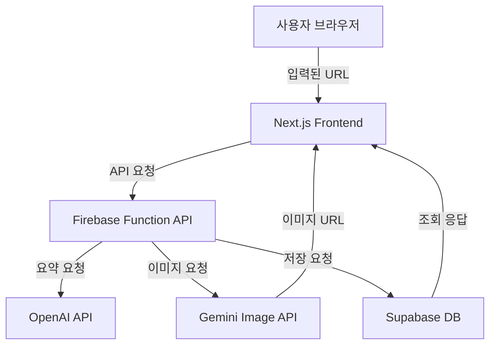

# 🧩 HYP MVP 개발 문서

> **버전:** 0.1.0  
> **작성일:** 2025-10-16  
> **작성자:** 김성훈  
> **목표:** MVP 기간 내(2주) 제품 홍보 콘텐츠 자동 생성 기능 완성

---

## 1. 개요

**HYP**은 사용자가 제품의 링크(URL)를 입력하면 AI가 제품을 분석하고,  
홍보용 텍스트 및 이미지를 자동 생성하여 이미지 콘텐츠로 생성하는 웹 서비스입니다.

---

## 2. 시스템 아키텍처



3. 기술 스택

   | 구분     | 기술                 | 비고                                       |
   | -------- | -------------------- | ------------------------------------------ |
   | Frontend | Next.js (App Router) | React 기반 SPA                             |
   | Backend  | Firebase             | Functions API Gateway 역할                 |
   | Database | Supabase             | (PostgreSQL) 요약 데이터 및 생성 결과 저장 |
   | Hosting  | Vercel (무료 플랜)   | 프론트엔드 배포                            |
   | AI API   | OpenAI GPT-5, Gemini | 텍스트 / 이미지 생성                       |
   | Auth     | (MVP 미포함)         | 이후 단계에서 추가                         |
   | Storage  | Firebase Storage     | 이미지 임시 저장                           |

4. 화면 구조 (Page Flow)

   | 단계 | 페이지               | 주요 컴포넌트 설명                                 |
   | ---- | -------------------- | -------------------------------------------------- |
   | 1    | /                    | LinkInputPage: 제품 링크 입력                      |
   | 2    | /summary             | ProductSummaryPage: 제품명, 기능 등 요약 확인/수정 |
   | 3    | /concept             | ConceptSelectPage: 홍보 컨셉 선택                  |
   | 4    | /concept/:id/preview | ConceptPreviewPage: 컨셉 미리보기                  |
   | 5    | /upload              | ImageUploadPage: 이미지 업로드 or AI 생성 선택     |
   | 6    | /editor              | EditorPage: 텍스트/이미지 편집                     |
   | 7    | /result              | ResultPage: 결과 미리보기 및 PNG 다운로드          |

5. 주요 기능 요약

   | 기능              | 설명                                         | MVP 포함 여부 |
   | ----------------- | -------------------------------------------- | ------------- |
   | 제품 링크 분석    | OpenAI API를 이용해 제품명/특징 요약         | ✅            |
   | 홍보 컨셉 선택    | 고정된 템플릿 4개 중 선택                    | ✅            |
   | AI 텍스트 생성    | 선택된 컨셉 + 제품 요약 기반                 | ✅            |
   | AI 이미지 생성    | Gemini API (없을 경우 자동 생성)             | ✅            |
   | 에디터            | 이미지 내 텍스트 편집 (폰트, 색, 위치, 크기) | ✅            |
   | PNG 다운로드      | 결과물 저장                                  | ✅            |
   | 공유 링크         | SNS 공유 기능                                | ❌            |
   | 회원가입 / 로그인 | Firebase Auth 연동                           | ❌            |

6. 데이터 구조
   6.1 ProductSummary (요약 데이터)
   ```typescript
   interface ProductSummary {
     id: string;
     url: string;
     title: string;
     description: string;
     features: string[];
     targetUsers: string[];
     createdAt: string;
   }
   ```

6.2 GeneratedContent (생성 결과)

```typescript
interface GeneratedContent {
  id: string;
  summaryId: string;
  conceptId: string;
  prompt: string;
  imageUrl?: string;
  textOptions: string[]; // 2개 버전
  selectedTextIndex?: number;
  finalImageUrl?: string;
  createdAt: string;
}
```

6.3 Concept (고정 템플릿)

```typescript
interface Concept {
  id: string;
  name: string;
  description: string;
  exampleImage: string;
  promptTemplate: string;
}
```

7. API 명세
   7.1 POST /api/summary

설명: URL에서 제품 정보 요약

```json
Request:
{
"url": "https://example.com/product"
}

Response:
{
"title": "스마트 수면 밴드",
"features": ["수면 분석", "AI 패턴 인식", "맞춤 알람"],
"targetUsers": ["불면증 사용자", "수면 패턴 개선을 원하는 사람"]
}
```

7.2 POST /api/generate-text

설명: 선택된 컨셉 + 제품 요약으로 홍보 문구 생성

```json
Request:
{
"conceptId": "modern-minimal",
"summary": {
"title": "스마트 수면 밴드",
"features": ["AI 수면 분석", "맞춤 알람"],
"targetUsers": ["불면증 사용자"]
}
}

Response:
{
"options": [
"당신의 수면을 데이터로 바꾸다. 스마트 밴드로 매일 아침을 새롭게.",
"AI로 설계된 수면 리듬. 더 깊은 잠을 경험하세요."
]
}
```

7.3 POST /api/generate-image

설명: 이미지가 없는 경우 AI 이미지 생성 요청 (Gemini)

```json
Request:
{
"conceptId": "modern-minimal",
"summary": "AI 수면 밴드, 당신의 하루를 바꾸는 스마트 솔루션"
}

Response:
{
"imageUrl": "https://storage.googleapis.com/.../generated-image.png"
}
```

7.4 POST /api/save-content

설명: 최종 생성 결과 저장

```json
Request:
{
"summaryId": "uuid",
"conceptId": "modern-minimal",
"selectedTextIndex": 0,
"finalImageUrl": "https://storage.googleapis.com/.../final.png"
}
Response:
{
"status": "ok",
"contentId": "uuid"
}
```

8. 퍼널 로직 (단계별 진입 기준)

   | 단계    | 진입 조건                          | 저장 시점          |
   | ------- | ---------------------------------- | ------------------ |
   | summary | URL 입력 성공                      | URL 저장           |
   | concept | 요약 확정                          | summary 저장       |
   | upload  | 컨셉 선택                          | conceptId 저장     |
   | editor  | 이미지 업로드 완료 or AI 생성 완료 | imageUrl 저장      |
   | result  | 콘텐츠 편집 완료                   | finalImageUrl 저장 |

9. 상태 관리 구조

Recoil / Zustand 중 선택 (가볍게 전역 상태 관리)

저장 정보

```ts
interface FunnelState {
  url: string;
  summary?: ProductSummary;
  concept?: Concept;
  textOptions?: string[];
  selectedTextIndex?: number;
  imageUrl?: string;
}
```

10. 이미지 에디터 구성
    | 컴포넌트 | 기능 |
    | ---------------- | -------------------------------- |
    | `EditorCanvas` | 이미지 렌더링, 텍스트 위치 조정 (Drag & Drop) |
    | `TextToolbar` | 폰트 / 색상 / 크기 / 정렬 |
    | `DownloadButton` | PNG 다운로드 (html2canvas 사용 예정) |

11. AI 프롬프트 설계
    (1) 제품 요약 생성

    ```diff
    Given the product webpage, extract:
    ```

- Product name
- 3 key features
- Target users (short phrases)

(2) 홍보 문구 생성

```arduino
Write 2 short marketing copies for this product in Korean.
Tone & Style: {conceptStyle}
Use max 30 words.
```

12. 배포 & 환경 변수
    | 항목 | 변수명 | 설명 |
    | --------------- | ---------------------- | ----------- |
    | OpenAI API Key | `OPENAI_API_KEY` | 텍스트 생성 |
    | Gemini API Key | `GEMINI_API_KEY` | 이미지 생성 |
    | Supabase URL | `SUPABASE_URL` | DB 연결 |
    | Supabase Key | `SUPABASE_SERVICE_KEY` | 서비스 키 |
    | Firebase Config | `FIREBASE_*` | 스토리지, 함수 설정 |

13. 로깅 / 에러 처리

- 모든 API 요청은 Firebase Function 로그에 기록
- AI 요청 실패 시 재시도 최대 1회
- 이미지 생성 실패 시 기본 placeholder 이미지 반환

14. 초기 KPI (MVP 검증 지표)
    | 지표 | 목표 |
    | ------------ | ------ |
    | URL 입력 횟수 | 100 |
    | 콘텐츠 생성 완료 | 10 |
    | AI 이미지 생성 비율 | 30% |
    | 평균 생성 시간 | 30초 이내 |

15. 개발 일정
    | 항목 | 기간 | 담당 |
    | ---------- | ------------- | --- |
    | 기획 및 디자인 | 10/16 ~ 10/18 | 김성훈 |
    | 프론트엔드 개발 | 10/19 ~ 10/25 | 김성훈 |
    | 백엔드/API 연동 | 10/23 ~ 10/28 | 김성훈 |
    | 테스트 및 배포 | 10/29 ~ 10/31 | 김성훈 |

16. 차기 버전 고려사항

- 회원가입 / OAuth (Google)
- 공유 링크 생성 (SNS)
- 템플릿 커스터마이징
- 이미지 배경 제거 / 리사이즈 기능
- Analytics Dashboard (유저 행동 데이터 시각화)
